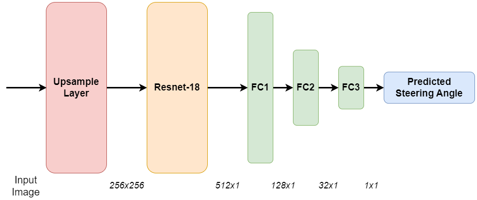

# Duetsch and Sodamin Solution for the Self Driving Car Challenge

For the *Masterpraktikum - Simulation-Based Autonomous Driving in Crowded City* we were given the
drive a car in a simulation environment by using a deep learning approach.
This repository contains our solution to the problem.  
The functionality of our program may depend on your hardware.
We tested the program on the following PCs, without any performance issues.

*  ```
   CPU: Ryzen 7700
   GPU: Nvidia RTX 3090
   RAM: 64GB DDR5
   ``` 
* ```
  CPU: Ryzen 5800x
  GPU: Nvidia RTX 3070
  RAM: 32GB DDR4
  ```

## Results

1. A user must provide a path for the car to drive. This is done by listing commands for the car previous to execution.
   These state the desired behavior at each intersection.
   Each command can be one of the following: *left*, *straight*, *right*.
2. The car will try to follow the given path. Two examples for this can be seen below:
    1. [Right > Left > Straight > Right](https://www.youtube.com/watch?v=AmJI5OUDUuQ)
    2. [Left > Right > Left](https://www.youtube.com/watch?v=lNdI4D9mgdM)

## Repository Structure

In the following, the most important folders / files are shortly explained.

```
├───...
├───data
│   ├───<example_data_directory>
│   │   ├───IMG                           # Directory containing the images of the dataset.
│   │   ├───VehicleData.txt               # File which contains the collected vehicle data and the image paths.
├───models                                # Directory where the models are stored.
├───src                                   # Directory containing all the source code of the project.
│   │   ...                      
│   │   constants.py                      # Containts the configuration for the project.
│   │   control_output.py                 # Class which represents the output to the simulator.
│   │   main.py                           # Starting point for the execution.
│   │   simulator_control.py              # Class which contains the logic of driving and communication to the simulator.
│   ├───ai
│   │   │   ...
│   │   │   train_model.ipynb             # Jupyter notebook to train the driving model.
│   │   ├───distance_detection            # Contains logic to detect the distance to the next car.
│   │   ├───models                        
│   │   │   │   ...
│   │   │   │   model.py                  # Superclass for all different types of models.
│   │   │   │   resnet_model.py           # The class of the model we enden up using.
│   │   ├───traffic_light_detection       # Contains the logic for traffic light detection.
│   ├───cspsg                             # Git submodule to cspsg repository. Used it during development.
│   ├───data_handling                     
│   │   │   combine_datasets.ipynb        # Notebook to contain multiple datasets and optionally add steering biases.
│   │   │   data_preprocessing.ipynb      # Notebook to test some image processing methods.
│   │   │   filter_relevant_data.ipynb    # Notebook to filter datasets.
│   │   │   track_dataset.py              # Class which represents a dataset.
│   │   │   track_data_element.py         # Represents one element in the dataset: an image and its corresponding steering angle. 
├───navigations.yaml                      # Provide a path which the car should follow here.
├───requirements.txt                      # Contains python requirements necessary for the project.
```

## Setup

### Installing the Simulator

We tested and developed the version *WindowsV25-2.zip* of the simulator on Windows 11.
It can be downloaded from the [lrz cloud](https://syncandshare.lrz.de/dl/fiEQ6uWeJQFmosTX7HsxwG/v0.25/WindowsV25-2.zip).

### Setup Requirements

We highly recommend PyCharm for the following steps.  
In Pycharm, do the following:
**Right click on the _src_ folder -> Mark Directory as -> Mark Directory as sources root**

#### Venv Setup

1. Create a new venv at the root of the repository. We used Python 3.10 for the project.  
   `python -m venv venv`
2. Active it or select it as the python interpreter for the project in your IDE.  
   `.\venv\Scripts\activate`

#### Installing requirements

1. Install the requirements from *requirements.txt*  
   `pip install -r requirements.txt`
2. Install a cuda version of pytorch from [the pytorch website](https://pytorch.org/).  
   `pip3 install torch torchvision --index-url https://download.pytorch.org/whl/cu118`

### Downloading Example Dataset

In order to train the model, we used about 23,000 training images for the *non-intersection*
model which can be downloaded **temporarily** from
our [Google Drive](https://drive.google.com/file/d/1Nbh20oOt-5eVB8X8bSeY6yv5i1bqbUg_/view?usp=sharing).  
Store the folder in the data directory, e.g.:

```
├───data
│   ├───75k_balanced_data
│   │   ├───IMG                           # Directory containing the images of the dataset.
│   │   ├───VehicleData.txt               # File which contains the collected vehicle data and the image paths.
```

Note that although the dataset is named _75k_balanced_data_, it only consists of about 23,000 training images.
This is due to the fact, that we removed a lot of the data points with a steering angle of 0 to reduce 
dataset imbalance.
This was done using the notebook _src/data_handling/filter_relevant_data.ipynb_.

## Execution

As discussed in the setup, we highly recommend PyCharm for the development and execution.

### Training a Model

This can be done in the notebook _src/ai/train_model.ipynb_.  
**Don't forget to set the *TRAINING_DATA_DIR* in _src/constants.py_.**  
_If there is an error message from pytorch lightning about torchaudio, simply uninstall torchaudio._

#### Default Model

For training the _non-intersection_ model, set _TURN_TRAIN_MODE_ to False in _src/constants.py_.

#### Intersection Model

For training the _non-intersection_ model, set _TURN_TRAIN_MODE_ to True in _src/constants.py_.  
Also select a different *TRAINING_DATA_DIR* depending on the type of model.  
E.g. For a right turn model, provide data which mainly consists of right turns and only a few data points with a
steering angle of 0.  
To generate such data, use the notebook _src/data_handling/filter_relevant_data.ipynb_.

### Running the Simulator Control

#### Prerequisites

1. **Do not forget to set a rout in _navigations.yaml_ beforehand!**
2. **Make sure to set _GERMAN_NUMBERS_ to True in _src/constants.py_, if you are on german windows.**

#### Execution

Execute the file _src/main.py_ and run the simulator in test mode.   
It should automatically connect and start the run.

```bash
cd src
python main.py
```

## Methodology

In the following, the methodology of our approach is described.
It is structured into the parts _Data Collection_, _Model Details_, and _Simulator Control_.
Another description of our methodology with more sources and details can be found in our practical course report.
However, many parts of this chapter will be very similar to the methodology part in the report. 

### Data Collection

We used three different methods of data collection, which are described in the following.

#### Manual Data Collection

This is the standard way to collect data in the simulator.
Using a gamepad controller, we collected our own driving data on which we trained some models.
The disadvantage of this approach was, that it took a lot of time to record sufficient data.
Also, the data did include some driving mistakes from our side.
Therefore, the quality of the training data was not perfect.

#### Automatic Data Collection

To be able to reduce the time necessary for data collection and increase the quality of the data we chose
to use automatic data collection.
After getting access to the unity project, we simply copied the camera of our car to one of the bot vehicles.
To diversify training data and not overfit, we also generated a much bigger city to drive in.
It was generated using the same plugin the original map was generated with.
Therefore, we ensured that both cities are still very similar.
Then we started the simulation, increased the simulation time speed, and simply waited until a
sufficient amount of data was collected.
Training on data which was collected using automated data collection worked quite well, however, 
in some situations, our model still struggled to output the correct steering angle.
Also, it didn't learn to recover from a bad situation, like driving partly on the pavement.

#### Hybrid Data Collection
This approach combines the previous two and tackles both their disadvantages.
First, we automatically collected a lot of data and train a model on it. 
Then, we test the model and look for situations in which it struggles to perform (curves, recovering from a bad situation).
Afterwards, we collected additional data in which we correctly handle these situations.
In the end, we simply merged multiple datasets using the notebook _src/data_handling/combine_datasets.ipynb_.
It also offers the possibility to add a steering bias to the dataset, which we used to for example make 
all steering angles point towards the middle of the road, when the car is off center. 

### Data Cleaning
In our case, this was about one hour of driving data or about 75,000 images.
As described above, we collected about 75,000 images but only ended up training on about 23,000 of them.
This is due to the fact, that we removed a lot of the data points with a steering angle of 0 to reduce 
dataset imbalance.
This was done using the notebook _src/data_handling/filter_relevant_data.ipynb_.

### Model Details
We tried multiple different model architectures, like a cnn-lstm model (inspired by [this repository](https://github.com/pranoyr/cnn-lstm)), the nvidia model, a ResNet model
which additionally receives the segmentation output of a model as an input, and a few more.
In the end, we simply used a model based on a ResNet-18 with the architecture seen below.


The cnn-lstm model achieved slightly better performance then our ResNet-18.
However, this was only the case when we had subsequent datapoints in our dataset.
Since we randomly filtered a lot of the datapoints with a steering angle of 0 and merged different data recordings,
we couldn't guarantee, that the lstm only gets input subsequent datapoints.
Therefore and due to the fact that the ResNet-18 already achieves a very good performance,
we decided to stick to the ResNet-18, which doesn't require the temporal consistency.

### Simulator Control
Besides the main thread of our software, which continuously listens to any http requests from the simulator, 
our software consists of two threads running asynchronously.
Both are started in the method _run_ of the class _SimulatorControl_.
The first thread is responsible for traffic light detection and distance computation to the next vehicle.
The other one is responsible to compute the control output based on the current camera image.
Additionally, we receive a http request containing the current image multiple times a second.
When receiving such a request, we update the current image and respond with a previously computed control output
containing the throttle, brake and steering angle values which should be applied. 
The advantage of this approach is, that we do not have a large delay in our response.
Our hardware allows us to recompute the control output and traffic light detection results with a high frequency. 
Therefore, even though the computed control output in the response is most likely based on a previous image,
it is recent enough to not decrease our performance.

#### Steering Angle Prediction
As described above, we use a model which is based on a ResNet-18 to predict a steering angle.
We input the live camera image into the model, which then outputs a steering angle. 

#### Traffic Light Classification
For the traffic light detection we use an approach based on a pretrained _YOLOv8_ model [from ultralytics](https://ultralytics.com).

1. Detection:  
We use the _YOLOv8_ model to detect any traffic lights in the view and crop out / select any detected traffic lights
in the center of the image.  
An example of a cropped out traffic light is the following:   
   
2. Classification:  
We empirically selected three hsv masks to filter the traffic light colors green, yellow, and red in the cropped out 
traffic lights. 
The traffic light with the most pixels of one of the three colors is considered as the dominant (front-facing) traffic light.
Depending on the size of the colored region, the color of the traffic light is used as the classified traffic light color.
3. Stopping Command:  
If a red light is detected in front of the car, it stops immediately.

#### Traffic Distance Computation
The detection information of the [_YOLOv8_ model](https://ultralytics.com) which is used for the traffic light detection,
can also be used for the computation of the distance.
The YOLO8 model detects multiple classes at the same time, such as cars, trucks, buses, or traffic lights.
For the distance computation we only consider the detections of other vehicles which are approximately in the center
of the image.
The higher the y-coordinates of the detected bounding box of a vehicle, the closer the vehicle is to our own car.
We compute the distance to the closest car, by computing the maximum y-coordinate of the bounding boxes. 

#### Control Output Computation
The computation of the control output happens in the method _drive_ of the class _SimulatorControl_.
As stated above, we obtain the steering angle by our trained steering model.
Since we do not receive the current velocity in the simulator version we used, we initially always use a
throttle value of 80%.
We then run a smoothing across our past throttle and braking values.
We always use the lowest of our past 5 throttle values and the highest of our past 3 braking values.
This is done to enable a more careful driving.
If we stand still in front of a red traffic light, we don't want a single wrong prediction affect our result.
We do not smooth the steering angle values, since the model should be able to quickly react.
After having our control values smoothed, we brake according to the distance to the next vehicle as described above.
For very high steering values however, we do brake in case of a close vehicle.
This is because, only vehicles in front of us are detected.
Therefore, if we make sharp turns, we will most likely not hit them.
As a last step, we process the results of the traffic light detection.
If we encounter a red light, we stop.

#### Navigation
The logic of this module mainly happens in the class _SimulatorControl_.
Our approach in the beginning of the project was, to train a single end-to-end model based on a high amount of driving data.
We managed to train such a model which is able to keep the lane on the straight and in curves.
Situations in which the model was performing weak, were reduced by manually collecting additional training data.
However, there was one major flaw with this approach. 
The training data did include three different behaviors at intersections: Driving left, straight, and right. 
During the training process, the ground truth steering angle at an intersection could point in any of the three directions. 
This lead to an undetermined behavior at testing time. 
The car chose any of the three directions at random and was strugggling to successfully handle intersections at all. 
It was possible that steering angle predictions of subsequent frames point in opposite directions, since there was no input to the model to encode in which direction it should drive. 

We tackle this problem, by training four different models.
One general model, for all situations which are not at an intersection and three models for each possible direction of an intersection.
The idea is to switch betweens the models to predict a steering angle, depending on the intended behavior.
For example, if it is desired to turn left at an intersection, the left turn model is selected until the intersection is finished. 
The behavior should be given prior to the execution of the code.

In the following, the three stages necessary for navigation are described.

1. Training Specific Intentions:  
The general model is trained using our complete dataset as described at the beginning of this chapter. 
For the others, we created three new training datasets by filtering the complete dataset in the notebook _src/data_handling/filter_relevant_data.ipynb_.
The model which should simply drive straight at an intersection (no-turn model) was only trained on data, which had relatively small absolute steering angle values. 
Therefore, the model only learns to make small corrections and to not make any sharp turns. 
The left and right turn models are trained on left and right turn data mixed with some straight line data. 
The amount of straight line data in the dataset was highly reduced compared to the original one.
This was done for two reasons.
   1. The models did only output a relatively small steering angle, due to the imbalance of the dataset (much more training data elements with a steering angle of 0). 
   2. Reduce the occurrence of situations in which the car drove straight at an intersection.  
2. Detecting Intersections:  
For the navigation approach to work, it is essential to reliably detect when a new intersection starts and finishes.
Otherwise, the wrong model may be selected at an intersection and the navigation goal won't be reached.
To detect an intersection, the traffic light detection output can be used.
As soon as a traffic light is detected, it is assumed that the car is currently at an intersection.
Afterwards, if there is no detected traffic light for two seconds, than it is assumed that the intersection has ended.
This method is used to count the intersections which were already encountered.
3. Navigation Implementation:  
The direction in which the car should drive can be given by the configuration in _navigations.yaml_.
This navigation configuration consists of a list of directions which is given prior to execution of the program.
The possible values are _left_, _straight_, and _right_.
An example is seen below.
At the first intersection, the right-turn model is selected and at the second intersection, the no-turn model is selected.
The models are selected by counting the encountered intersections, as previously described.
After all navigation commands were executed, it is assumed that the car has arrived at its goal and the program stops the car.
```yaml
navigations:
  - right
  - straight
  ```
